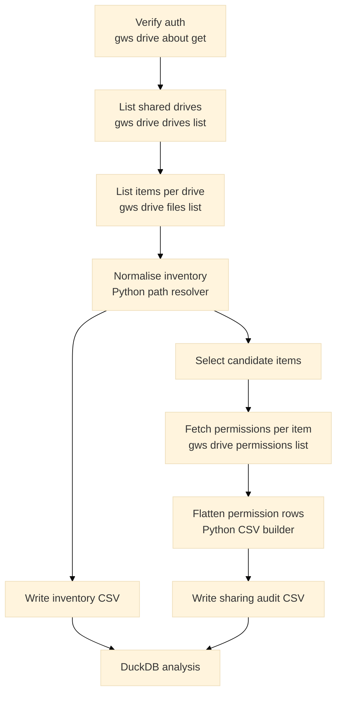

# Google Drive shared content audit

This repository gives you a repeatable way to inventory Google Drive shared
drives, flatten sharing metadata into local CSV reports, query those reports
with DuckDB, and optionally plan or execute controlled remediation. It uses
`gws` for authentication and API access, Bash for orchestration, and Python for
JSON normalisation and remediation planning.

You can use it as a practical audit workflow when you need answers such as:

- Which shared drives contain directly shared files or folders.
- Which users, groups, domains, or anyone links have direct access.
- Which items are worth investigating or remediating first.

The project is designed for operators who want a transparent local workflow.
Every run keeps the raw API payloads, the flattened CSVs, and a run summary, so
you can inspect exactly how the results were produced.

## Why this exists

Google Drive sharing data is easy to fetch and awkward to analyse. The Drive
API returns nested JSON, permissions can be inherited or direct, and shared
drive inventory often spans many pages of results. This repository turns that
surface into a simpler local analysis model that you can query immediately.

The main benefits are:

- You get a full inventory CSV for the shared drives you enumerate.
- You get a second CSV that expands item permissions into one row per
  permission, which is much easier to query in DuckDB.
- You keep the raw API responses and failure logs, which makes the workflow
  debuggable when Drive output or CLI behavior changes.

## What you need

Before you run the audit, make sure you have the right access and local tools.
The repository can install most of the toolchain for you, but it cannot grant
Drive visibility that your identity does not already have.

- A Google Workspace identity that can see the shared drives you want to audit.
  A Workspace admin identity is the simplest option if you need broad
  visibility.
- `mise`, if you want the repository to manage the local versions of `gws`,
  `python`, `jq`, `duckdb`, and `bats` for you.
- Enough local disk space for raw API payloads and generated CSVs. The audit
  keeps intermediate data on purpose so you can inspect and resume runs.

This repository ignores `output/` by default because generated audit and
remediation artifacts can contain live Drive metadata, permission rows, and the
authenticated identity used for the run. Treat everything under `output/` as
local working data, not as publishable fixtures.

## Quick start

If you want the fastest path to a useful result, follow this sequence. It gets
you from a clean checkout to a queryable sharing report in a few minutes.

1. Move into the repository, trust the local `mise` config if needed, and
   install the toolchain.

   ```bash
   cd /path/to/google-drive-auditing
   mise trust
   mise install
   ```

2. Authenticate `gws` with an identity that has Drive access to the shared
   drives you want to inspect.

   ```bash
   gws auth login -s drive
   ```

3. Run the audit. By default, the script creates a timestamped directory under
   `./output`.

   ```bash
   ./audit-shared-drive-content.sh
   ```

4. Point your shell at the latest run directory.

   ```bash
   RUN_DIR="$(ls -dt output/[0-9]* | head -1)"
   AUDIT_CSV="$RUN_DIR/reports/shared-drive-sharing-audit.csv"
   INVENTORY_CSV="$RUN_DIR/reports/shared-drive-inventory.csv"
   SUMMARY_FILE="$RUN_DIR/reports/run-summary.txt"
   ```

5. Inspect the summary and run a first query.

   ```bash
   sed -n '1,200p' "$SUMMARY_FILE"
   duckdb -c "
     SELECT shared_drive_name, COUNT(*) AS permission_rows
     FROM read_csv_auto('$AUDIT_CSV')
     GROUP BY 1
     ORDER BY 2 DESC
   "
   ```

If you use Fish instead of Bash or Zsh, use this variable setup:

```fish
set RUN_DIR (ls -dt output/[0-9]* | head -1)
set AUDIT_CSV $RUN_DIR/reports/shared-drive-sharing-audit.csv
set INVENTORY_CSV $RUN_DIR/reports/shared-drive-inventory.csv
set SUMMARY_FILE $RUN_DIR/reports/run-summary.txt
```

## What the repository contains

The repository is small, but each top-level file has a distinct role. This
section is the quickest way to orient yourself before you start changing or
extending the workflow.

- `audit-shared-drive-content.sh` runs the shared drive inventory and sharing
  audit workflow from end to end.
- `google_drive_auditing.py` normalises inventory JSON, builds the audit CSV,
  and plans remediation actions.
- `remove-drive-sharing.sh` optionally removes one specific direct permission
  or removes all direct item-level sharing from selected items.
- `examples/` contains redacted example data, example DuckDB queries, and
  example remediation exports.
- `tests/` contains the Bats suite for the audit and remediation flows.
- `mise.toml` pins or selects the local tool versions used by the repository.

## Repository workflow at a glance

The audit has a simple command-line interface, but it performs a multi-stage
workflow under the hood. `gws` handles the API requests, Bash coordinates the
run, and Python turns nested JSON into flat CSV reports.



At a high level, a successful run does three things for you:

- It inventories every non-trashed item returned by the shared drive file
  listing phase.
- It expands permissions for a subset of items, or for every item if you opt
  into a full sweep.
- It writes a run summary that tells you what happened, what was skipped, and
  where the outputs live.

## Choosing an audit scope

The most important runtime decision is how broadly you want to expand
permissions. The repository defaults to the higher-signal, lower-cost option so
that normal audit runs stay practical.

- `--permissions-scope augmented` is the default. It expands permissions only
  for items where Drive returns `hasAugmentedPermissions=true`. This is usually
  the best starting point for item-level sharing audits.
- `--permissions-scope all` expands permissions for every item returned during
  inventory. This gives you broader coverage, but it can become slow and
  expensive on large shared drive estates.

If your first run looks too small, rerun with `--permissions-scope all` before
you assume the audit is broken. In many environments, the default mode is
simply filtering the scope exactly as designed.

## What the audit produces

Every run writes both curated reports and intermediate files. That structure is
intentional: the reports are easy to query, and the intermediate data makes the
workflow inspectable and resumable.

The most important outputs are:

- `reports/shared-drive-inventory.csv`, which contains one row per inventoried
  item across the enumerated shared drives.
- `reports/shared-drive-sharing-audit.csv`, which contains one row per
  permission for the selected items in the permission expansion phase.
- `reports/run-summary.txt`, which records the authenticated identity, run
  settings, row counts, and failure counts.
- `reports/drive-fetch-failures.tsv` and
  `reports/permission-fetch-failures.tsv`, which capture partial failures
  without discarding the rest of the run.
- `raw/`, which stores the page-level `gws` responses used to build the final
  outputs.
- `work/`, which stores normalised intermediate files such as the resolved
  inventory JSONL and candidate item lists.

After a successful run, start with `run-summary.txt`. It is the fastest way to
confirm whether the scope, row counts, and failure counts match what you
expected.

## How the audit works

This section walks through the audit stages in the order they execute. If you
need to debug a run or explain the workflow to another operator, this is the
best place to start.

### 1. Verify authentication

The run starts with `gws drive about get` using a narrow `fields` selector.
This proves that `gws` is authenticated and records the effective identity into
`work/about.json` and the run summary.

If authentication fails, the script stops early and preserves the CLI error in
`work/auth-check.stderr.log`. That gives you a concrete file to inspect instead
of a generic shell failure.

### 2. Enumerate shared drives

Once authentication succeeds, the script calls `gws drive drives list` and
stores the raw response pages in `raw/drives-pages.ndjson`. By default, the
request uses `useDomainAdminAccess=true`.

The script then extracts a one-drive-per-line control file in
`work/drives.jsonl`. Every later stage uses that file as its source of truth.

### 3. Inventory items in each shared drive

For each discovered shared drive, the script calls `gws drive files list` with
`corpora=drive`, `includeItemsFromAllDrives=true`, and
`supportsAllDrives=true`. It requests non-trashed items and stores the raw
responses under `raw/drives/<drive-id>/`.

If one shared drive fails during listing, the script records the failure in
`reports/drive-fetch-failures.tsv`, logs the skip, and continues with the rest
of the run.

### 4. Resolve paths and build the inventory dataset

The first Python stage reads the combined inventory JSONL, builds an in-memory
index of items per drive, and walks parent pointers to produce human-readable
paths such as `Operations / Shared folder / Quarterly plan`.

This stage also classifies each item as a file, folder, or shortcut, copies
selected metadata into stable CSV columns, and selects the items that move into
the permission expansion phase.

### 5. Expand permissions for candidate items

The next Bash stage walks the candidate item list and calls
`gws drive permissions list` for each selected item. Raw permission responses
are written one item per file under `raw/permissions/`.

This is the most expensive part of the workflow, which is why the repository
defaults to the narrower `augmented` scope and supports `--resume`.

### 6. Flatten permission JSON into the audit CSV

The second Python stage reads the selected items and their permission payloads,
then writes one CSV row per permission. Each row carries the key item metadata
with it, so common DuckDB queries do not require a join back to the inventory
CSV.

This stage also reads `permissionDetails` and marks each permission as direct
or inherited-only. By default, inherited-only permission rows are excluded from
the final audit CSV to keep the output focused on the direct sharing surface.

### 7. Write a run summary

The final stage compiles the run metadata into `reports/run-summary.txt`. That
file records the effective identity, selected options, row counts, and failure
counts, and it points to the generated outputs.

## Configuration reference

The default settings are tuned for practical shared drive audits rather than
for exhaustive forensics. You can widen or narrow the scope with the options
below depending on whether you are doing a quick baseline run or a deeper
investigation.

- `--output-dir DIR` writes raw data, working files, and reports to a fixed
  directory instead of creating a new timestamped output folder.
- `--permissions-scope augmented|all` controls how broadly the script expands
  permissions after inventory.
- `--include-inherited-permissions` keeps inherited-only permission rows in the
  final audit CSV.
- `--drive-query QUERY` passes a Drive query to `gws drive drives list`, which
  lets you test the workflow on a smaller subset of shared drives.
- `--resume` reuses raw `gws` responses that already exist in the output
  directory.
- `--no-domain-admin-access` disables `useDomainAdminAccess` during shared
  drive enumeration.

If you are testing a new environment or a new `gws` release, start with a
small `--drive-query` and the default permission scope. That gives you a faster
feedback loop before you commit to a broad run.

## Querying with DuckDB

Once the audit finishes, the next step is usually analysis rather than another
script run. The CSV layout is designed so that you can answer common questions
with short DuckDB queries.

Start by reusing the latest-run variables from the quick start section:

```bash
RUN_DIR="$(ls -dt output/[0-9]* | head -1)"
AUDIT_CSV="$RUN_DIR/reports/shared-drive-sharing-audit.csv"
INVENTORY_CSV="$RUN_DIR/reports/shared-drive-inventory.csv"
```

These quick checks are a good starting point:

```bash
duckdb -c "SELECT COUNT(*) AS inventory_rows FROM read_csv_auto('$INVENTORY_CSV');"
duckdb -c "SELECT COUNT(*) AS audit_rows FROM read_csv_auto('$AUDIT_CSV');"
duckdb -c "SELECT * FROM read_csv_auto('$AUDIT_CSV') LIMIT 10;"
```

If you want an interactive DuckDB session, open a database and create views for
the two reports:

```bash
duckdb /tmp/google-drive-auditing.duckdb
```

Replace the sample paths below with the output directory from your own latest
run:

```sql
CREATE VIEW inventory AS
SELECT * FROM read_csv_auto('output/20260319-120000/reports/shared-drive-inventory.csv');

CREATE VIEW sharing AS
SELECT * FROM read_csv_auto('output/20260319-120000/reports/shared-drive-sharing-audit.csv');

SHOW TABLES;
DESCRIBE inventory;
DESCRIBE sharing;
SELECT * FROM sharing LIMIT 20;
```

## DuckDB query examples

The examples below show the kinds of questions the audit CSV is designed to
answer. Treat them as patterns that you can adapt to your own domain filters,
drive names, or remediation exports.

### Count directly shared items by shared drive

This query highlights where directly shared content is concentrated.

```sql
SELECT
  shared_drive_name,
  COUNT(DISTINCT item_id) AS directly_shared_items
FROM read_csv_auto('output/20260319-120000/reports/shared-drive-sharing-audit.csv')
GROUP BY 1
ORDER BY 2 DESC;
```

### Find external user and group shares

This query surfaces explicit shares that point outside your Workspace domain.

```sql
SELECT
  shared_drive_name,
  item_path,
  permission_type,
  permission_role,
  permission_email_address
FROM read_csv_auto('output/20260319-120000/reports/shared-drive-sharing-audit.csv')
WHERE permission_type IN ('user', 'group')
  AND permission_email_address <> ''
  AND permission_email_address NOT LIKE '%@example.com'
ORDER BY shared_drive_name, item_path;
```

### Find domain-wide and anyone links

This query surfaces the broadest sharing modes first.

```sql
SELECT
  shared_drive_name,
  item_path,
  permission_type,
  permission_role,
  permission_allow_file_discovery
FROM read_csv_auto('output/20260319-120000/reports/shared-drive-sharing-audit.csv')
WHERE permission_type IN ('domain', 'anyone')
ORDER BY shared_drive_name, item_path;
```

### Count directly shared folders

This query is useful because a shared folder can expose much more content than
an individually shared file.

```sql
SELECT
  shared_drive_name,
  COUNT(DISTINCT item_id) AS directly_shared_folders
FROM read_csv_auto('output/20260319-120000/reports/shared-drive-sharing-audit.csv')
WHERE item_is_folder = true
GROUP BY 1
ORDER BY 2 DESC;
```

## Example data and example SQL

The `examples/` directory gives you a safe way to practice the reporting and
remediation workflow without touching a live tenant. The example data is
redacted, but it preserves the row shapes and sharing patterns of a successful
real run.

The most useful example files are:

- `examples/load-redacted-example-data.sql`, which creates two example DuckDB
  tables.
- `examples/example-audit-queries.sql`, which runs common audit-style queries
  against the example tables.
- `examples/example-remediation-exports.sql`, which writes example CSVs in the
  shapes expected by `./remove-drive-sharing.sh`.

You can run the full example flow like this:

```bash
duckdb /tmp/google-drive-auditing-example.duckdb \
  < examples/load-redacted-example-data.sql
duckdb /tmp/google-drive-auditing-example.duckdb \
  < examples/example-audit-queries.sql
duckdb /tmp/google-drive-auditing-example.duckdb \
  < examples/example-remediation-exports.sql
```

If you want to inspect the example database interactively, open the same file
and query the tables directly:

```bash
duckdb /tmp/google-drive-auditing-example.duckdb
```

## Remediation workflow

The audit CSV is only half of the operational loop. Once you identify risky
shares, you often want to export a candidate set from DuckDB, review it, and
either remove one direct permission or remove all direct item-level sharing
from selected items.

The remediation script is intentionally conservative:

- It defaults to dry-run mode.
- It validates `revoke-permission` targets against the live permission snapshot
  before planning or executing a delete.
- It skips inherited-only permission rows.
- It skips owner, organizer, and `fileOrganizer` roles unless you explicitly
  pass `--include-management-roles`.

### Remove one specific share

Use `revoke-permission` when you already know which permission row you want to
remove. The audit CSV includes `permission_id`, which is the key the script
uses to match a live permission row before it deletes anything.

Export a candidate CSV like this:

```sql
COPY (
  SELECT
    item_id AS file_id,
    permission_id,
    shared_drive_name,
    item_path,
    permission_type,
    permission_role,
    permission_email_address,
    permission_domain,
    permission_is_direct,
    permission_is_inherited_only
  FROM read_csv_auto('output/20260319-120000/reports/shared-drive-sharing-audit.csv')
  WHERE permission_type IN ('user', 'group', 'domain', 'anyone')
    AND permission_email_address NOT LIKE '%@your-company.example'
) TO 'revoke-permissions.csv' (HEADER, DELIMITER ',');
```

Then plan and execute the removals:

```bash
./remove-drive-sharing.sh \
  --input revoke-permissions.csv \
  --mode revoke-permission

./remove-drive-sharing.sh \
  --input revoke-permissions.csv \
  --mode revoke-permission \
  --execute
```

### Remove all direct item-level sharing from selected files

Use `unshare-all-direct` when the decision is about the item rather than about
one specific grantee. This mode lists the current permissions for each selected
item, then removes every direct item-level permission it is allowed to remove.

Export a file list like this:

```sql
COPY (
  SELECT DISTINCT
    item_id AS file_id,
    shared_drive_name,
    item_path
  FROM read_csv_auto('output/20260319-120000/reports/shared-drive-sharing-audit.csv')
  WHERE item_path LIKE 'Shared Drive Alpha / External collaboration /%'
) TO 'unshare-files.csv' (HEADER, DELIMITER ',');
```

Then plan and execute the removals:

```bash
./remove-drive-sharing.sh \
  --input unshare-files.csv \
  --mode unshare-all-direct

./remove-drive-sharing.sh \
  --input unshare-files.csv \
  --mode unshare-all-direct \
  --execute
```

The remediation script writes planning artifacts, permission snapshots,
execution results, and a summary report under `output/remediation-<timestamp>/`
so you always have a local review trail.

## Toolchain and validated environment

The repository includes `mise.toml` so you can install the expected toolchain
without managing each dependency by hand. That makes the README easier to trust
and gives you a clearer baseline when you need to troubleshoot environment
differences.

The commands in this README were validated on March 19, 2026, with these
versions:

- `gws 0.18.1`
- `duckdb v1.5.0`
- `Python 3.14.3`
- `jq 1.8.1`
- `Bats 1.13.0`
- `Google Cloud SDK 561.0.0`
- `Node.js v25.8.1`
- `mise 2026.3.9`

`mise.toml` still uses `latest` for some tools so the project can track newer
releases. If a newer `gws` release changes flags or output shape, use the
versions above as the known-good baseline.

The current `mise.toml` includes:

- `node` and `"npm:@googleworkspace/cli"` for `gws`.
- `python`, `jq`, and `duckdb` for runtime processing and local analysis.
- `bats` for the test suite.
- `gcloud` as a useful adjacent tool, even though the scripts do not require it
  directly.

## Testing

The Bats suite verifies the audit and remediation workflows without touching a
live Google Workspace tenant. It stubs `gws`, injects representative Drive and
permission payloads, and verifies the generated CSVs, logs, and summaries.

Run the suite like this:

```bash
./run-bats-tests.sh
```

The current tests cover the highest-risk behaviors:

- The help output for the audit script.
- Default `augmented` mode behavior.
- Inclusion of inherited permissions when explicitly requested.
- Full permission expansion when `--permissions-scope all` is selected.
- Authentication failure handling.
- Dry-run and execute behavior for `revoke-permission`.
- Live validation and management-role protection in remediation mode.
- Direct-permission deletion behavior for `unshare-all-direct`.

## Limits and assumptions

This project is deliberately pragmatic. It is useful for shared drive audit and
remediation workflows today, but it is not trying to pretend that `gws` is a
complete governance platform.

- The audit targets shared drives. It does not enumerate personal `My Drive`
  content.
- The default mode focuses on the direct sharing surface. It does not expand a
  shared folder's inherited exposure through every descendant item.
- The path resolver only uses the inventory collected during the run. If a
  parent is missing, the path stops at the nearest known ancestor.
- Shortcut items appear in the inventory and audit output, but the workflow
  does not recursively expand the target item's own path or permissions.
- The current `gws` release does not provide first-class domain-wide
  delegation and impersonation support, so you need to run the audit as a
  suitably privileged identity.

## Troubleshooting

Most problems show up in the generated logs and summaries rather than as opaque
shell failures. If a run does not look right, start with the files below before
you change the code.

- If the script stops immediately with `gws authentication failed`, inspect
  `work/auth-check.stderr.log` and confirm that you authenticated the expected
  identity with `gws auth login -s drive`.
- If the audit CSV is unexpectedly small, read `reports/run-summary.txt` first.
  In many environments, the default `augmented` scope simply found no items
  where Drive reported `hasAugmentedPermissions=true`.
- If you want broader coverage, rerun with `--permissions-scope all`. That
  widens the audit, but it also increases API cost and run time.
- If some shared drives fail during inventory, inspect
  `reports/drive-fetch-failures.tsv`.
- If some items fail during permission expansion, inspect
  `reports/permission-fetch-failures.tsv`.

## Next steps

This repository gives you a strong local audit and analysis loop. The next
improvements usually depend on how you want to operationalise it.

- Schedule the audit to run on a regular cadence in a controlled environment.
- Persist the CSVs or normalised tables somewhere more durable than a local
  output directory.
- Add more organisation-specific DuckDB queries and remediation export shapes.
- Decide whether the default high-signal direct-sharing model is sufficient, or
  whether you need heavier full-sweep runs for narrower investigations.
